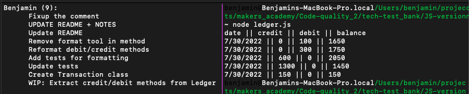

# Bank tech test

Today, you'll practice doing a tech test.

For most tech tests, you'll essentially have unlimited time.
This practice session is about producing the best code you can when there is a minimal time pressure.

You'll get to practice your OO design and TDD skills.

You'll work alone, and you'll also review your own code so you can practice reflecting on and improving your own work.

## Specification

### Requirements

* You should be able to interact with your code via a REPL like IRB or Node.
  (You don't need to implement a command line interface that takes input from STDIN.)
* Deposits, withdrawal.
* Account statement (date, amount, balance) printing.
* Data can be kept in memory (it doesn't need to be stored to a database or anything).

### Acceptance criteria

**Given**   a client makes a deposit of 1000 on 10-01-2023
  **And**   a deposit of 2000 on 13-01-2023
  **And**   a withdrawal of 500 on 14-01-2023
  **When**  she prints her bank statement
  **Then**  she would see

```
date       || credit    || debit  || balance
14/01/2023 ||           || 500.00 || 2500.00
13/01/2023 || 2000.00   ||        || 3000.00
10/01/2023 || 1000.00   ||        || 1000.00
```

## USAGE:

- run node
- require file
- example commands:

```javascript
  const transaction = new Transaction();
  transaction.credit(150);
  transaction.credit(1300);
  const ledger = new Ledger(transaction);
  console.log(ledger.formatReport());
```

## HOW TO USE

1. Access node from command line

`node`

2. Require files in node
```
const Transaction = require('./transaction);
```
3. Initialise Transaction
```
const transaction = new Transaction();
```
4. Make event
```
transaction.credit(500);
transaction.dedit(100);
```
5. Initialise Ledger with transaction as argument
```
const ledger = new Ledger(transaction);
```
6. Print with formatReport();
```
ledger.formatReport();
```

## SCREENSHOT:

